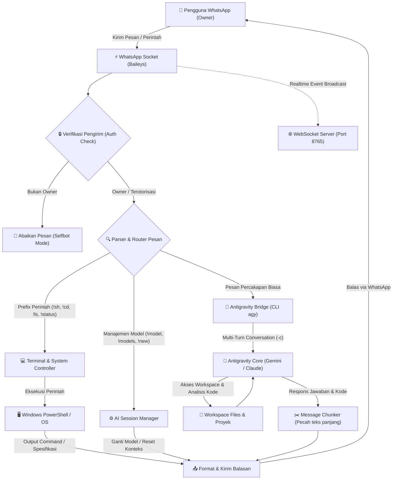
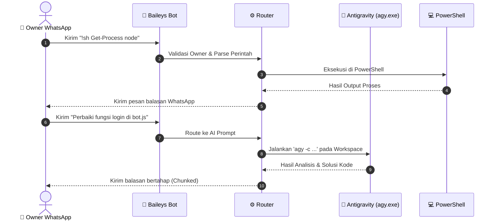

# 🤖 Bot WhatsApp Antigravity AI

> **WhatsApp AI Assistant & Container / Laptop Remote Controller**  
> Bridge mandiri yang menghubungkan akun **WhatsApp** Anda langsung ke **Antigravity CLI (`agy`)** dan **PowerShell / Terminal** di laptop atau server Windows.

---

## 📊 Arsitektur & Flowchart Sistem

Berikut alur kerja interaksi antara pengguna WhatsApp, core bot Baileys, eksekutor terminal, dan AI Engine Antigravity:



### 🔄 Alur Percakapan Detail (Sequence Diagram)



---

## 🌟 Keunggulan Utama

1. **⚡ Tanpa Butuh API Key Berbayar (Google AI Studio):**
   - Bot langsung terhubung ke binary **Antigravity CLI (`agy.exe`)** di laptop/server.
   - Menggunakan akun Google / Gemini Pro yang sudah aktif dan terautentikasi di laptop.
   - Tidak memerlukan langganan credit API tambahan.

2. **🧠 Multi-Turn Conversation & Full Workspace Access:**
   - Antigravity mengingat riwayat percakapan secara otomatis (flag `-c`).
   - Dapat membaca file, memeriksa bug, menjalankan script, dan menganalisis kode proyek di laptop langsung dari chat WhatsApp.

3. **💻 Remote PowerShell & File Explorer:**
   - Jalankan perintah PowerShell di laptop via `!sh <command>`.
   - Navigasi folder dan baca file: `!cd`, `!pwd`, `!ls`, `!cat`.
   - Pantau spesifikasi laptop/server: `!status` (CPU, RAM, Uptime).

4. **🔒 Keamanan Terkunci (Owner Only):**
   - Mode selfbot memastikan hanya nomor pemilik (dan nomor yang diizinkan via `!adduser`) yang dapat mengontrol bot.

5. **🔑 Pairing Code 8-Digit (Tanpa Scan Kamera):**
   - Cukup masukkan 8 karakter kode pairing di WhatsApp HP Anda -> **Perangkat Tertaut** -> **Tautkan dengan nomor telepon**.

6. **🌐 Realtime WebSocket Monitoring:**
   - Menyediakan WebSocket server ringan (port `8765`) untuk monitoring aktivitas bot secara realtime dari client eksternal.

---

## 🚀 Panduan Instalasi & Penggunaan

### 1. Prasyarat
- **Node.js** v18+ atau v20+
- **Antigravity CLI (`agy`)** terinstall di laptop / environment
- Koneksi Internet

### 2. Clone Repository
```bash
git clone https://github.com/sohivot/bot-wa-antigravity-ai.git
cd bot-wa-antigravity-ai
```

### 3. Install Dependensi
```bash
npm install
```

### 4. Konfigurasi Lingkungan (`.env`)
Salin file template `.env.example` ke `.env`:
```powershell
Copy-Item .env.example .env
```
Buka file `.env` dan sesuaikan nilainya:
```env
# Nomor WhatsApp Pemilik (Gunakan format 628xxxxxxxxxx tanpa +)
OWNER_NUMBER=6281234567890

# Nomor WhatsApp yang digunakan sebagai Bot
BOT_NUMBER=6289876543210

# Mode Selfbot (true = hanya respons Owner)
SELFBOT_MODE=true

# Mode Pairing Code (true = pairing via kode 8 digit)
USE_PAIRING_CODE=true

# Prefix perintah terminal & kontrol
COMMAND_PREFIX=!

# Folder kerja default untuk PowerShell & Antigravity
DEFAULT_CWD=C:\Users\Administrator\Downloads\bot-rcon

# Path binary agy.exe
AGY_PATH=C:\Users\Administrator\AppData\Local\agy\bin\agy.exe
```

### 5. Jalankan Bot
```bash
npm start
```

### 6. Hubungkan Akun WhatsApp (Pairing)
1. Terminal akan menampilkan **8 karakter Kode Pairing** (contoh: `ABCD-1234`).
2. Di aplikasi WhatsApp ponsel Anda:
   - Masuk ke **Menu Titik Tiga** (Android) atau **Pengaturan** (iPhone).
   - Pilih **Perangkat Tertaut (Linked Devices)**.
   - Ketuk **Tautkan Perangkat** -> pilih opsi **Tautkan dengan nomor telepon saja**.
   - Masukkan 8 karakter kode pairing yang tampil di terminal.
3. Selesai! Bot WhatsApp Anda aktif dan kredensial tersimpan di folder `session/`.

---

## 📖 Daftar Perintah (Command List)

| Perintah | Deskripsi |
|---|---|
| *(Pesan teks biasa)* | **Langsung ngeprompt Antigravity AI** (mengingat konteks percakapan) |
| `!help` | Menampilkan panduan dan daftar perintah |
| `!status` | Cek status laptop (CPU, RAM, Uptime, status model AI) |
| `!new` / `!reset` | Reset konteks sesi percakapan untuk memulai topik baru |
| `!models` | Lihat daftar model AI yang tersedia di Antigravity |
| `!model <nama>` | Ganti model AI aktif (contoh: `!model gemini-3.1-pro-high`) |
| `!stop` | Batalkan eksekusi task Antigravity yang sedang berlangsung |
| `!sh <command>` | Eksekusi perintah PowerShell langsung di laptop |
| `!cd <folder>` | Pindah folder kerja aktif |
| `!pwd` | Cek path direktori kerja aktif |
| `!ls` | Tampilkan daftar file & folder di direktori aktif |
| `!cat <file>` | Baca isi file teks |
| `!adduser <nomor>` | Tambahkan nomor admin tambahan |

---

## 📁 Struktur Direktori

```
bot-wa-antigravity-ai/
├── src/
│   ├── ai.js           # Google Gemini direct fallback engine
│   ├── antigravity.js    # Core bridge ke Antigravity CLI (agy.exe)
│   ├── commands.js       # Handler command router & logic
│   ├── terminal.js       # Controller PowerShell & file explorer
│   ├── websocket.js      # WebSocket server untuk realtime event
│   └── whatsapp.js       # Baileys WhatsApp client & auth handler
├── config.js             # Konfigurasi aplikasi
├── index.js              # Entry point utama aplikasi
├── package.json          # Manifest dependensi & script
├── .env.example          # Template konfigurasi environment
├── .gitignore            # Filter file sensitif & session
└── README.md             # Dokumentasi lengkap & flowchart
```

---

## 🛡️ Keamanan & Privasi
- File kredensial sesi (`session/`) dan environment (`.env`) diabaikan oleh `.gitignore` dan tidak akan ter-commit ke repository.
- Seluruh eksekusi shell dibatasi ketat berdasarkan validasi nomor Owner / Admin terdaftar.

---

## 📄 Lisensi
Proyek ini dilisensikan di bawah [MIT License](LICENSE).
