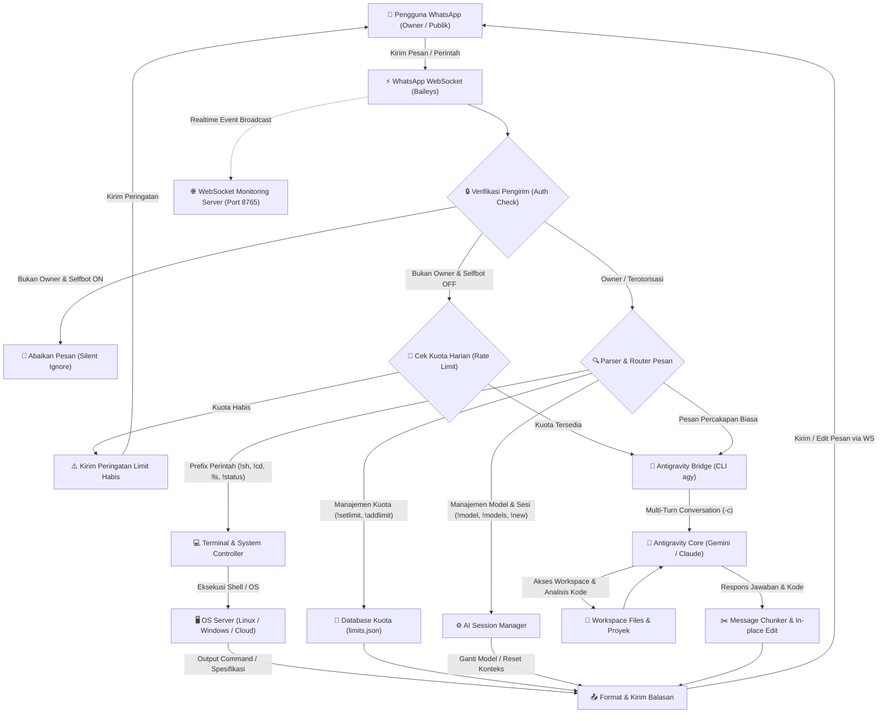
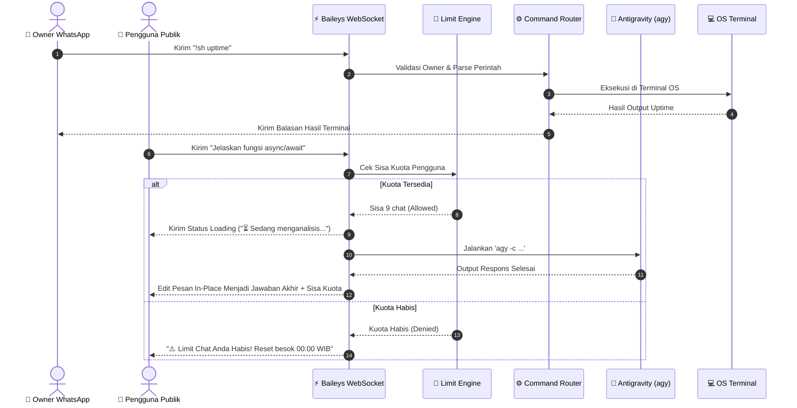

# 🤖 Bot WhatsApp Antigravity AI

> **WhatsApp AI Assistant & Cloud / VPS / RDP / Local Server Remote Controller**  
> Bridge mandiri yang menghubungkan akun **WhatsApp** Anda langsung ke **Antigravity CLI (`agy`)** dan **Terminal / Shell** di VPS, RDP, Cloud Server, maupun Komputer Lokal.

---

## 📊 Arsitektur & Flowchart Sistem

Berikut alur kerja interaksi antara pengguna WhatsApp, core bot Baileys (WhatsApp WebSocket), eksekutor terminal, dan AI Engine Antigravity:



### 🔄 Alur Percakapan Detail (Sequence Diagram)



---

## 🌐 Mengapa Menggunakan WhatsApp WebSocket (Baileys)?

Bot ini dibangun menggunakan **`@whiskeysockets/baileys`**, pustaka native yang berkomunikasi langsung dengan server WhatsApp melalui protokol **WebSocket murni (`wss://web.whatsapp.com/ws/chat`)** dengan serialisasi binary **Protocol Buffers (Protobuf)**.

### 🚀 Keunggulan WhatsApp WebSocket Dibandingkan Browser Automation (Puppeteer / Selenium):
1. **Sangat Ringan (Super Low RAM):**
   - Baileys hanya memakan RAM sekitar **~40 MB – 60 MB**, sangat ideal untuk VPS / RDP berkapasitas RAM 512 MB – 1 GB.
   - Puppeteer atau Selenium membutuhkan browser Chromium utuh yang mengonsumsi **500 MB – 1 GB+ RAM** dan beban CPU tinggi.
2. **Headless & Ramah Cloud:**
   - Tidak memerlukan GUI atau display server (Xvfb) sama sekali. Berjalan mulus di server Linux (Ubuntu, Debian, CentOS) maupun Windows Server / RDP.
3. **Mendukung Fitur Pesan Bergerak (In-Place Edit / Dynamic Animation):**
   - Protokol WebSocket WhatsApp mendukung pengubahan konten pesan yang sudah terkirim secara langsung via `sock.sendMessage(jid, { text, edit: messageKey })`.
   - **Fitur ini memungkinkan pembuatan animasi interaktif**, seperti:
     - Indikator progres realtime (misalnya: status kompilasi file, progress bar download/build).
     - **Minigame Interaktif Bergerak**: Game Tic-Tac-Toe, Ular Tangga, Snake, Slot Machine, atau Catur yang merender papan permainan langsung di pesan yang sama tanpa perlu spam pesan baru.

---

## 🌟 Fitur & Keunggulan Utama

1. **⚡ Tanpa Butuh API Key Berbayar (Google AI Studio):**
   - Bot langsung terhubung ke binary **Antigravity CLI (`agy`)** di server.
   - Menggunakan akun Google / model AI yang sudah aktif dan terautentikasi di server.
   - Tidak memerlukan langganan credit API berbayar per-token.

2. **🔋 Sistem Kuota & Upgrade Limit untuk Pengguna Publik:**
   - Bot memiliki fitur **Mode Selfbot** (`!selfbot on/off`).
   - Saat selfbot dimatikan (`!selfbot off`), pengguna lain dapat mencoba chat dengan AI secara publik.
   - Setiap pengguna non-owner dibatasi oleh kuota harian (default: 10 chat/hari) yang di-reset otomatis setiap pukul 00:00 WIB.
   - Owner dapat meng-upgrade atau menambah kuota nomor tertentu secara langsung lewat chat (`!setlimit` dan `!addlimit`).

3. **🧠 Multi-Turn Conversation & Akses Workspace Penuh:**
   - Antigravity mengingat riwayat percakapan secara otomatis (flag `-c`).
   - Dapat membaca file, memeriksa bug, menjalankan script, dan menganalisis kode proyek di server langsung dari WhatsApp.

4. **💻 Remote Terminal & File Explorer (Owner Only):**
   - Jalankan perintah shell / command-line langsung di server via `!sh <perintah>`.
   - Navigasi direktori dan baca file: `!cd`, `!pwd`, `!ls`, `!cat`.
   - Pantau spesifikasi server: `!status` (CPU, RAM, Uptime, Hostname).

5. **👁️ Auto-Read Chat (Silent Notifications):**
   - Fitur `!autoread on` untuk otomatis menandai pesan masuk sebagai terbaca (centang biru), mencegah tumpukan notifikasi di HP pengguna.

6. **🔑 Pairing Code 8-Digit (Tanpa Scan Kamera):**
   - Cukup masukkan 8 karakter kode pairing di WhatsApp HP Anda -> **Perangkat Tertaut** -> **Tautkan dengan nomor telepon**.
   - Sangat mudah dipasangkan di VPS / RDP tanpa perlu membuka QR gambar.

---

## 🚀 Panduan Instalasi & Penggunaan

### 1. Prasyarat
- **Node.js** v18+ atau v20+
- **Git**
- **Antigravity CLI (`agy`)** terinstall dan terautentikasi di VPS, RDP, atau Mesin Lokal

### 2. Clone Repository
```bash
git clone https://github.com/angrepps/bot-wa-antigravity-ai.git
cd bot-wa-antigravity-ai
```

### 3. Install Dependensi
```bash
npm install
```

### 4. Konfigurasi Lingkungan (`.env`)
Salin file template `.env.example` ke `.env`:
```bash
# Di Linux / VPS:
cp .env.example .env

# Di Windows / PowerShell:
Copy-Item .env.example .env
```

Buka file `.env` dan sesuaikan nilainya:
```env
# Nomor WhatsApp Pemilik (Gunakan format 628xxxxxxxxxx tanpa tanda +)
OWNER_NUMBER=6281234567890

# Nomor WhatsApp yang digunakan sebagai Akun Bot
BOT_NUMBER=6289876543210

# Mode Selfbot (true = hanya respons Owner, false = publik dengan sistem kuota)
SELFBOT_MODE=true

# Mode Pairing Code (true = pairing via kode 8 digit tanpa QR)
USE_PAIRING_CODE=true

# Prefix perintah terminal & kontrol
COMMAND_PREFIX=!

# Folder kerja default untuk Terminal & Antigravity
DEFAULT_CWD=/root/workspace

# Path binary agy (sesuaikan path di VPS Linux atau Windows Server)
# Linux: /usr/local/bin/agy atau /root/.agy/bin/agy
# Windows: C:\Users\Administrator\AppData\Local\agy\bin\agy.exe
AGY_PATH=agy
```

### 5. Menjalankan Bot
```bash
# Menjalankan langsung:
npm start

# Atau menjalankan sebagai background service (disarankan untuk VPS menggunakan PM2):
npm install -g pm2
pm2 start index.js --name "wa-ai-agent"
pm2 save
```

### 6. Hubungkan Akun WhatsApp (Pairing)
1. Terminal / log akan menampilkan **8 karakter Kode Pairing** (contoh: `ABCD-1234`).
2. Di aplikasi WhatsApp ponsel Anda:
   - Buka **Menu Titik Tiga** (Android) atau **Pengaturan** (iPhone).
   - Pilih **Perangkat Tertaut (Linked Devices)**.
   - Ketuk **Tautkan Perangkat** -> pilih tautan **Tautkan dengan nomor telepon saja**.
   - Masukkan 8 karakter kode pairing yang tampil di log terminal.
3. Bot WhatsApp langsung aktif dan sesi login disimpan di folder `session/`.

---

## 📖 Daftar Perintah (Command List)

### 👥 Perintah Umum & Publik
| Perintah | Deskripsi |
|---|---|
| *(Pesan teks biasa)* | Chat langsung dengan AI Antigravity (mengingat konteks percakapan) |
| `!help` | Menampilkan panduan dan daftar perintah |
| `!limit` / `!ceklimit` | Cek sisa kuota chat harian akun Anda |
| `!status` | Cek status server (RAM, CPU, Hostname, Uptime, status model AI) |
| `!game` / `!miniapp` | Buka HTML5 Mini App Game (Cyber Runner & AI Tic-Tac-Toe) |

### 👑 Perintah Khusus Owner / Administrator
| Perintah | Deskripsi |
|---|---|
| `!selfbot on / off` | Mengaktifkan/menonaktifkan mode private (hanya membalas Owner) |
| `!autoread on / off` | Otomatis baca chat masuk (menghilangkan notifikasi HP) |
| `!setlimit <nomor> <max>` | Mengubah limit kuota harian nomor tertentu (contoh: `!setlimit 628123456789 50`) |
| `!addlimit <nomor> <bonus>` | Menambahkan bonus kuota chat ke nomor tertentu (contoh: `!addlimit 628123456789 25`) |
| `!adduser <nomor>` | Menambahkan nomor admin/owner baru |
| `!new` / `!reset` | Mereset konteks sesi percakapan untuk memulai topik baru |
| `!models` | Melihat daftar model AI yang tersedia di Antigravity |
| `!model <0-5>` | Mengganti model AI aktif (contoh: `!model 1` untuk Gemini Flash) |
| `!stop` | Membatalkan eksekusi task AI yang sedang berjalan di background |
| `!sh <perintah>` | Menjalankan perintah terminal/shell langsung di server |
| `!cd <folder>` | Berpindah direktori kerja aktif di server |
| `!pwd` | Menampilkan path direktori kerja aktif |
| `!ls` | Menampilkan daftar file & folder di direktori aktif |
| `!cat <file>` | Membaca isi file teks di server |

---

## 📁 Struktur Direktori

```
bot-wa-antigravity-ai/
├── public/
│   └── game.html       # HTML5 Mini App Arcade Game (Cyber Runner & Tic-Tac-Toe)
├── src/
│   ├── ai.js           # Fallback direct Gemini engine
│   ├── antigravity.js    # Bridge komunikasi ke Antigravity CLI (agy)
│   ├── commands.js       # Router perintah, otorisasi, & logika eksekusi
│   ├── embed.js          # WhatsApp visual embed & card styling engine
│   ├── limits.js         # Engine kuota harian & rate limiting pengguna
│   ├── terminal.js       # Controller terminal OS (Linux bash / Windows PS)
│   ├── websocket.js      # HTTP Mini App & WebSocket realtime server
│   └── whatsapp.js       # Baileys native WebSocket client & pairing handler
├── config.js             # Loader konfigurasi lingkungan (.env)
├── index.js              # Entry point utama aplikasi
├── package.json          # Manifest dependensi & script runner
├── .env.example          # Template konfigurasi environment aman
├── .gitignore            # Filter pengabaian session, data kuota, & .env
└── README.md             # Dokumentasi lengkap sistem
```

---

## 🛡️ Keamanan & Privasi

- **Zero Credential Leaks:** File sesi login (`session/`), basis data kuota (`data/`), dan file environment (`.env`) secara ketat diabaikan oleh `.gitignore` sehingga aman dari kebocoran ke GitHub.
- **Terminal Execution Security:** Eksekusi perintah terminal (`!sh`, `!cd`, `!cat`) hanya dapat diakses oleh nomor Owner yang telah diverifikasi melalui JID/LID resmi WhatsApp.
- **Rate Limit Protection:** Kuota per-user mencegah server kehabisan resource saat bot dibuka untuk umum (`!selfbot off`).

---

## 📄 Lisensi
Proyek ini dilisensikan di bawah [MIT License](LICENSE).
